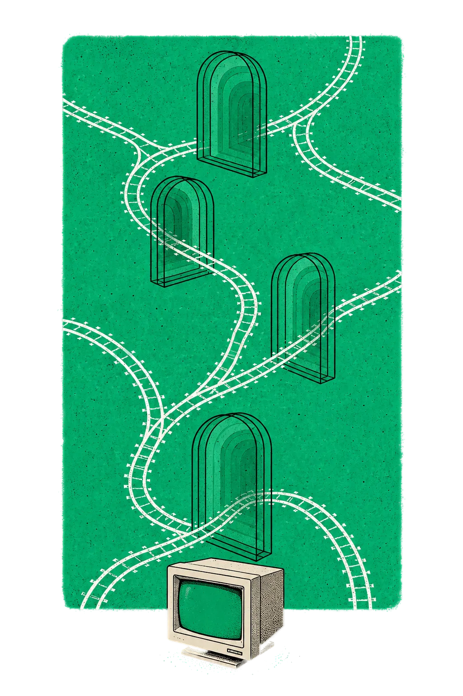

# fut

> fear, uncertainty and ... terminals?

[Install with Homebrew](https://github.com/mikker/homebrew-tap):

```sh
brew install mikker/tap/fut
```

[Documentation](https://fut.sh)

## Agent integrations

Fut can show native lifecycle activity from Claude Code and Codex. Install Fut
first, then verify that the installed version supports agent reporting:

```sh
fut agent report --help
```

### Claude Code

```sh
claude plugin marketplace add mikker/fut
claude plugin install fut@fut-integrations
```

Launch Claude Code inside Fut. Run `/hooks` in Claude Code to verify that the
Fut handlers are loaded.

### Codex

```sh
codex plugin marketplace add mikker/fut
codex plugin add fut@fut-integrations
```

Codex delivers final turn completion through its machine-local `notify`
command. Install Fut's notification adapter at a stable path:

```sh
mkdir -p "$HOME/.local/bin"
curl -fsSL \
  https://raw.githubusercontent.com/mikker/fut/main/integrations/codex/plugins/fut-codex/scripts/fut_codex_lifecycle.py \
  -o "$HOME/.local/bin/fut-codex-notify"
chmod +x "$HOME/.local/bin/fut-codex-notify"
```

Then add this to `~/.codex/config.toml`:

```toml
notify = [
  "fut-codex-notify",
  "--notify",
]
```

If `notify` is already configured, have that program dispatch the same JSON
argument to Fut's adapter instead of adding a second setting. Restart Codex,
launch it inside Fut, then run `/hooks` and trust the Fut hooks when prompted.
The command assumes `~/.local/bin` is on `PATH`.
